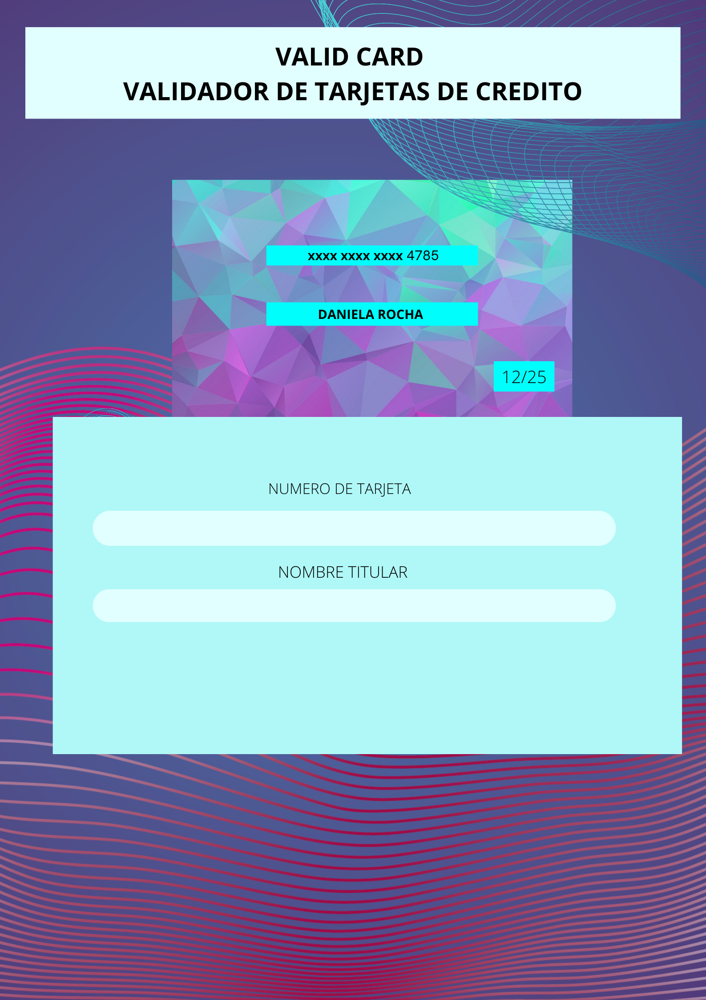
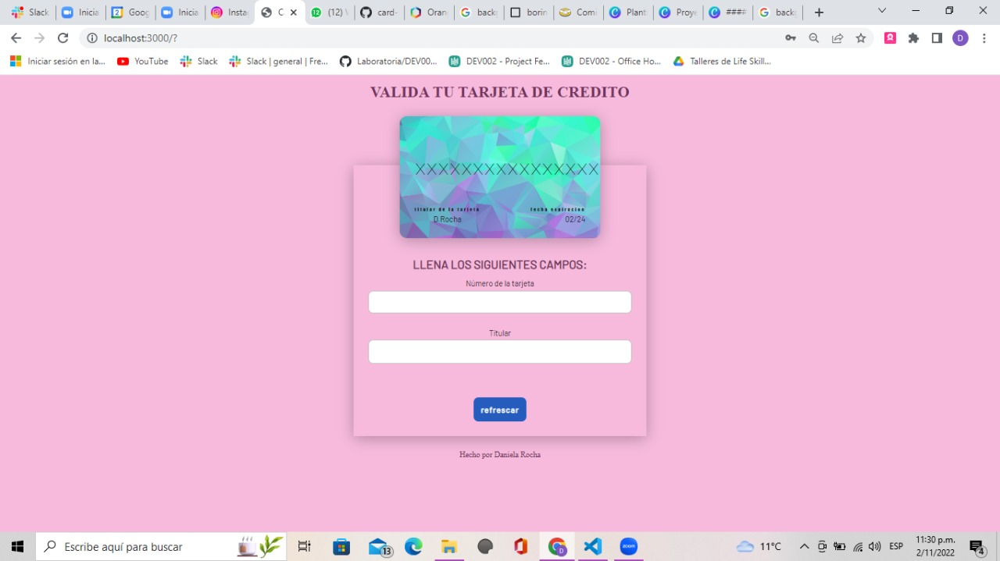

TITULO
Card validation

Web diseñada para la validacion de tarjetas de credito. La cual puede usar cualquier tipo de usuario.

### Definición del producto

* Quiénes son los principales usuarios de producto.
* Cuáles son los objetivos de estos usuarios en relación con tu producto.
* Cómo crees que el producto que estás creando está resolviendo sus problemas.

**/Mi producto es universal. Cualquier persona que quiera validar su tajeta ya sea para pagar una suscripcion, para hacer una compra por internet. O ya sea solo para saber si su tarjeta es valida.
**/Validar su tarjeta para compras,pagos etc.
**/El usuario podra saber el estado de su tarjeta de manera facil y rapida.

### UX (Diseño de experiencia de usuario)
**PROTOTIPO A LAPIZ

**PROTOTIPO HECHO EN CANVA

**IMAGEN FINAL DE PROYECTO

* Trabaja tu primer prototipo con papel y lápiz (blanco y negro).
* Luego valida esta solución con una compañera (pedir feedback).
* Toma lo aprendido al momento de validar tu primer prototipo y desarrolla un
  nuevo prototipo usando alguna herramienta para diseño de prototipos
 

